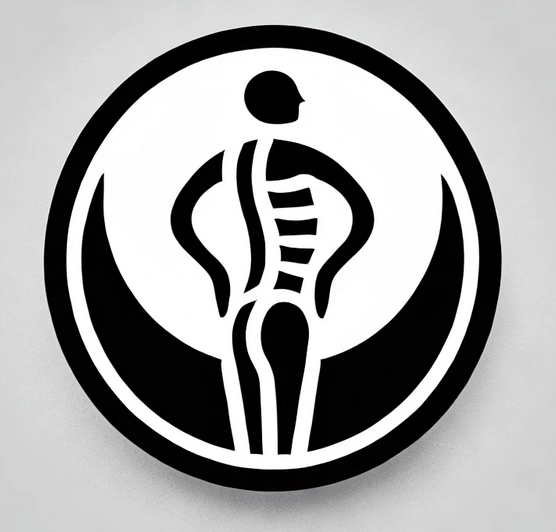

# OpenCV2 Posture Corrector 🖥️➡️🧘

**Revolutionize Your Workspace Ergonomics with Real-Time Posture Monitoring**


**OpenCV2 Posture Corrector** is a cutting-edge, real-time posture monitoring application designed to help you maintain optimal posture while working at your computer. Seamlessly integrated into your system tray, this application uses advanced computer vision to analyze your posture through your webcam, providing instant feedback and alerts to keep you ergonomically aligned.

---

## 🌟 Features

- **Real-Time Posture Scoring**: Get instant feedback with a posture score ranging from 0 to 100.
- **System Tray Integration**: Minimalistic and unobtrusive, always available when you need it.
- **Visual Feedback**: Color-coded score display for quick posture assessment.
- **Customizable Tracking**: Adjust tracking intervals from continuous monitoring to 4-hour checks.
- **Live Video Feed**: Optional video window to visualize posture analysis in real-time.
- **Smart Notifications**: Receive automatic alerts when poor posture is detected.
- **Cross-Platform**: Fully compatible with Windows, macOS, and Linux.
- **Privacy First**: All processing is done locally—no data is ever stored or transmitted.

---

## 📸 Interface Preview

### System Tray Icon

*System tray icon indicating posture status*

### Menu Options

*Available options in the toolbar menu*

---

## 🚀 Getting Started

### **Windows Installation**

1. Ensure you have Python 3.10 installed.
2. Install dependencies:
   ```bash
   py -3.10 -m pip install -r requirements.txt
   ```
3. Make sure you have the Visual C++ Redistributable installed.
4. If issues persist, install the MSVC runtime:
   ```bash
   py -3.10 -m pip install msvc-runtime
   ```

### **Linux Installation**

1. Install required dependencies:
   ```bash
   sudo apt install -y \
       libxcb1 \
       libxcb-xinerama0 \
       libxcb-cursor0 \
       libxkbcommon-x11-0 \
       libxcb-render0 \
       libxcb-render-util0
   ```
2. For additional features, install optional packages:
   ```bash
   sudo apt install -y \
       qt6-base-dev \
       qt6-wayland \
       libqt5x11extras5
   ```

### **General Installation**

1. Install dependencies:
   ```bash
   pip install -r requirements.txt
   ```
2. Launch the application:
   ```bash
   python src/main.py
   ```

### 🎯 Basic Usage

- **Start Monitoring**: Click the system tray icon and select "Start Tracking."
- **Enable Video Feed**: Optionally enable the video window to see real-time posture analysis.
- **Set Tracking Interval**: Choose your preferred monitoring frequency.
- **Monitor Your Score**: Keep an eye on your posture score (0-100) via the tray icon.
- **Receive Alerts**: Get notified when your posture needs correction.

---

## 🛠️ Technical Stack

- **MediaPipe**: For precise pose detection and landmark tracking.
- **OpenCV**: Powers video processing and visualization.
- **PyQt6**: Ensures a sleek and responsive system tray interface.
- **Platform-Specific Notifications**: Native alerts for Windows, macOS, and Linux.

---

## 🔒 Privacy Commitment

Your privacy is paramount. OpenCV2 Posture Corrector processes all video data locally on your machine. No video or posture data is ever stored, shared, or transmitted over the internet. Your data stays yours, always.

---

## 📈 Future Roadmap

- **Posture History**: Track and visualize your posture trends over time.
- **Advanced Analytics**: Gain insights into your ergonomic habits.
- **Customizable Alerts**: Tailor notifications to your specific needs.
- **Integration with Productivity Tools**: Sync with calendars and productivity apps for smarter reminders.

---

## 🤝 Contributing

We welcome contributions! Please read our Contribution Guidelines to get started.

---

## ⭐ Why Star This Project?

If you find this project useful, consider giving it a star on GitHub! Starring helps us:

- **Gain visibility**: Reach more developers and users.
- **Encourage development**: Motivate us to keep improving and adding features.
- **Grow the community**: Build a network of users and contributors.

Thank you for your support! Together, we can promote better ergonomics for everyone.
